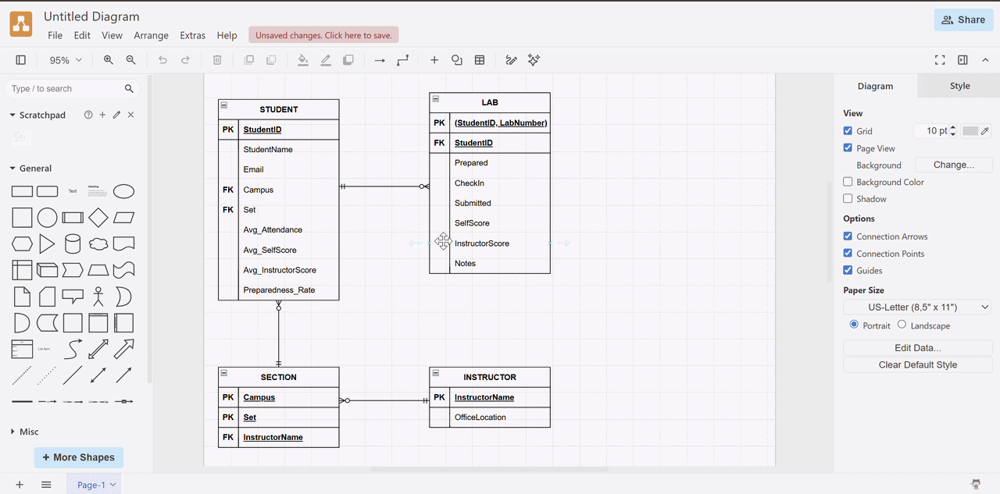
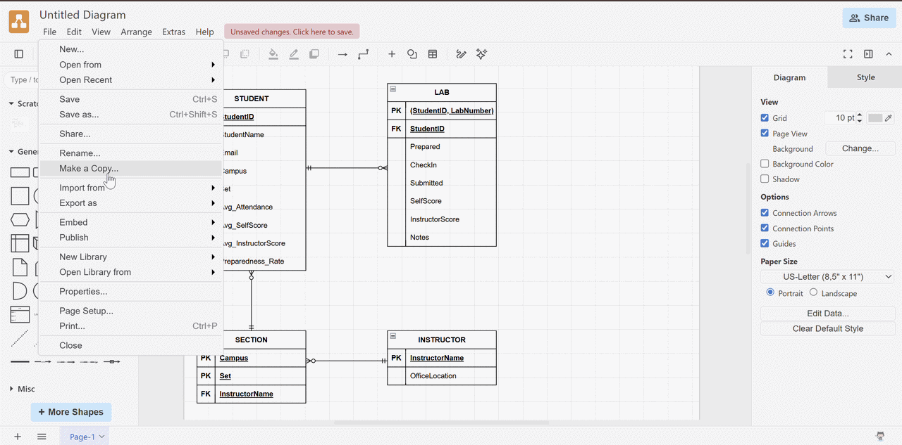
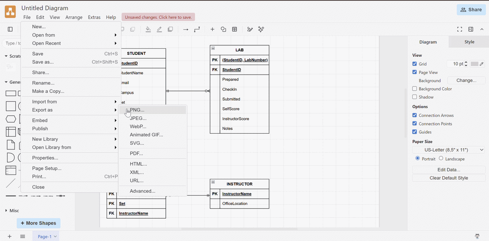
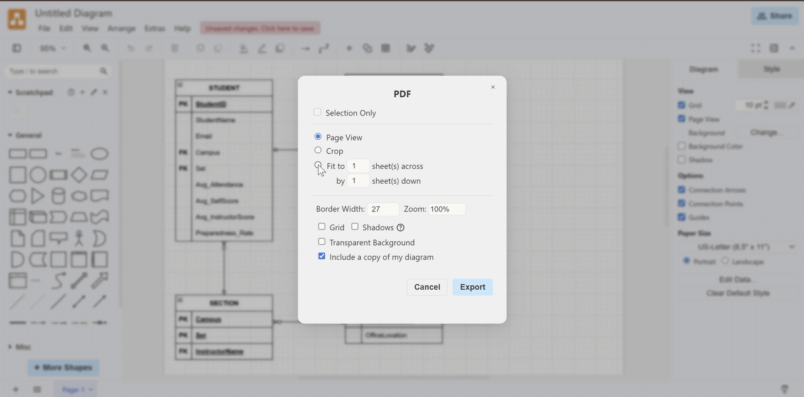
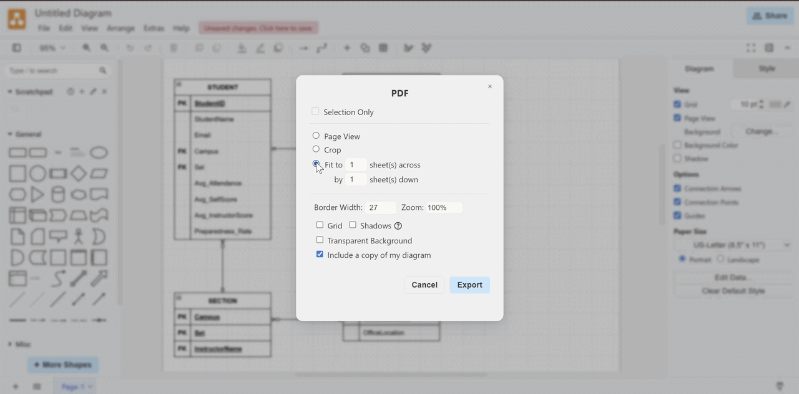
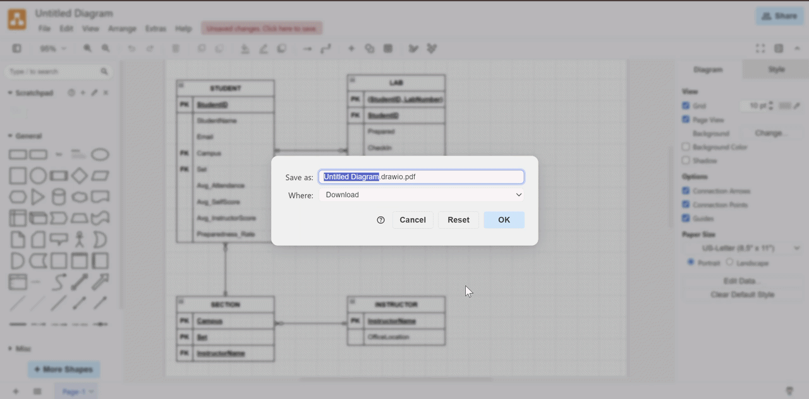

# Save File

## Overview

Draw.io provides various tools to create and modify shapes while creating diagrams from scratch. This guide provides information on several methods on how to deal with shapes. Starting from the basics of shapes and providing some advanced tips and tricks, you will be able to save the file and view the final result.

## How to Save and Export a Diagram

### Step 1: Finish the Diagram

Make sure your diagram is complete before exporting it.

### Step 2: Check for Errors

Review the diagram for any spelling mistakes, missing labels, incorrect connections, or formatting issues.

### Step 3: Click **File**

Click the **File** menu in the top-left corner of the screen.

  

### Step 4: Click **Export As**

From the **File** menu, select **Export As**.

  

### Step 5: Choose the File Type

Select the file type you want to export.

!!! recommendation "**Recommendation:**"
    Export your diagram as a **PDF** unless your instructor asks for a different file type.

  

### Step 6: Choose **Fit to**

Adjust the export settings if needed, including the **Fit to** option.

  

### Step 7: Name the File

Enter a clear and appropriate file name.

  

### Step 8: Choose **Download**

Click the dropdown menu and choose **Download**.

  

### Step 9: Click **Save**

Click **Save** to begin exporting the file.

### Step 10: Wait for the Download

A new tab may open during the export process.

!!! warning "**Note:**"
    Do not close the new tab right away. Wait until you see the download notification in the top-right corner of your browser.

### Step 11: Open the Final File

Open the exported file to make sure it downloaded correctly and looks the way you expected.